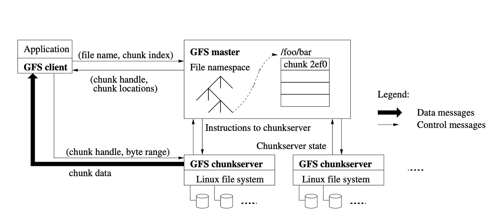
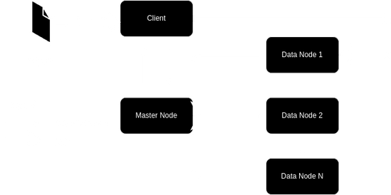

# Distributed Filesystem

## Authors
## [Bohdan Hashchuk](https://github.com/gashchukk)
## [Dmytro Khamula](https://github.com/hamuladm)


### Project description
This paper presents a distributed file system inspired by the Google File System (GFS), designed to handle large amounts of data on multiple computers. The system is built to be fault-tolerant and efficient, storing multiple copies of data and a master-slave architecture to manage files.

Architecture of GFS:



Our architecture:



### Compilation of the project
Use the following command to compile the whole project
```bash
make compile
```
Also there is a useful tool for cleaning the project
```bash
make clean
```
It removes executables, build folders, etc.


### To run client
```bash
./bin/client <file_path>
```

### To run chunkNode server
```bash
./compile.sh
./bin/node {port}
```

### To run masterNode server
```bash
./compile.sh
./bin/masterNode
```

By default `masterMode` uses port 8080, so make sure you used different ports for `chunkNode`s. For instance, 8081, 8082, 8083 would do perfectly.
